# What Makes LLMs Different From Each Other?

Despite being built on largely the same data, large language models exhibit dramatically different capabilities, personalities, and failure modes. This document explains the key axes of differentiation and defines the technical vocabulary needed to understand them.

---

## Flow: From Prompt to Response

The following diagram shows how a user prompt travels through the layers of an LLM system to produce a response. Each stage in this pipeline represents a set of design decisions where model vendors diverge.

```mermaid
flowchart TD
    A["👤 User Prompt"] --> B["Tokenizer"]
    B -->|"Text → Token IDs"| C["Embedding Table"]
    C -->|"Token IDs → Vectors"| D["Positional Encoding\n(RoPE / ALiBi)"]
    D --> E["Transformer Layers\n(repeated N times)"]

    subgraph E["Transformer Block × N Layers"]
        direction TB
        E1["Multi-Head Attention\n(GQA / Sliding Window / MLA)"] --> E2["Layer Normalization\n(LayerNorm / RMSNorm)"]
        E2 --> E3["Feedforward Network\n(Dense or MoE Experts)"]
        E3 --> E4["Layer Normalization"]
    end

    E --> F["Output Projection"]
    F -->|"Vector → Vocabulary Probabilities"| G["Sampling / Decoding"]
    G -->|"Select Next Token"| H["Detokenizer"]
    H --> I["📝 Response Text"]

    G -.->|"Loop until\nstop condition"| B

    style A fill:#4A90D9,stroke:#2C5F8A,color:#fff
    style I fill:#5CB85C,stroke:#3D7A3D,color:#fff
    style E fill:#f0f0f0,stroke:#999
    style E1 fill:#F5A623,stroke:#C47D0E,color:#fff
    style E3 fill:#D0021B,stroke:#8B0115,color:#fff
```

**Key points in the diagram:**

- **Tokenizer**: Different models break text into tokens differently, affecting multilingual performance and efficiency.
- **Positional Encoding**: Transformers process all tokens simultaneously with no built-in concept of word order — without positional encoding, "the dog bit the man" and "the man bit the dog" are indistinguishable. RoPE encodes position by mathematically rotating token vectors, so the angle between any two tokens implicitly captures how far apart they are. ALiBi takes a simpler approach, penalizing attention scores proportionally to distance. The practical impact is significant: a model trained with a 4K context window using RoPE can often generalize to 16K or 32K at inference time with minimal degradation, while older absolute position methods break down entirely beyond their training length. This is why positional encoding choice is a primary factor in whether a model can handle book-length inputs versus struggling past a few pages.
- **Attention**: The most computationally expensive step and the primary engineering bottleneck. In standard multi-head attention, every token computes a relevance score against every other token — 10,000 tokens means 100 million score calculations (quadratic scaling). GQA reduces the memory footprint by having multiple query heads share key-value pairs, cutting the KV cache (the stored state from previous tokens) by 4x or more with minimal quality loss. Sliding window attention limits each token to attending only to its nearest neighbors (e.g., 4,096 tokens) rather than the full sequence, converting the quadratic cost to linear. Flash Attention doesn't change the math at all — it reorganizes the computation to minimize slow GPU memory transfers, achieving 2–4x speedup for free. These aren't mutually exclusive; production models typically combine several of these techniques. The choices made here directly determine whether a model can process a 200-page document in seconds or minutes, and at what hardware cost.
- **Feedforward Network**: In dense models, all parameters activate. In MoE models, a router selects a subset of expert networks per token.
- **Sampling Loop**: The model generates one token at a time, feeding each output back as input for the next. The KV cache stores attention state to avoid redundant recomputation.

---

## 1. Architecture Choices

The "transformer" is the shared foundation, but implementations diverge significantly.

**Attention mechanisms** — Standard multi-head attention scales quadratically with sequence length (every token attends to every other token). Models handle this differently. Some use grouped query attention (GQA), where multiple query heads share a single key-value head, dramatically reducing memory overhead. Others use sliding window attention, where tokens only attend to a local neighborhood plus a few global anchor tokens. Flash Attention is an implementation optimization that reorders computation to minimize GPU memory reads/writes — same math, very different performance. These choices directly affect how well a model handles long documents versus short conversations.

**Dense vs. Mixture-of-Experts (MoE)** — A dense model activates all parameters for every token. An MoE model (like Mixtral or reportedly GPT-4) routes each token through only a subset of specialized "expert" sub-networks via a gating function. So a model might have 1.8 trillion total parameters but only activate 200 billion per token. This means you can build a much larger model that's cheaper to run at inference, but training stability is harder — experts can collapse (all tokens route to the same expert) or load-balance poorly. The routing strategy itself becomes a critical design decision.

**Positional encoding** — Transformers have no inherent sense of token order, so you have to inject position information. Older models used fixed sinusoidal encodings or learned absolute positions. Most modern models use RoPE (Rotary Position Embeddings), which encode relative position through rotation matrices applied to query and key vectors. This generalizes better to sequence lengths longer than training data. ALiBi takes a different approach, adding a linear bias to attention scores based on distance. These choices directly determine how well a model extrapolates to longer contexts than it was trained on.

**Normalization and layer structure** — Where you place layer normalization (pre-norm vs. post-norm), whether you use RMSNorm instead of LayerNorm (saves compute by dropping the mean-centering step), whether you use parallel attention and feedforward blocks instead of sequential — all of these affect training stability and throughput. DeepSeek, for example, has published work on Multi-head Latent Attention (MLA), which compresses the key-value cache into a lower-dimensional latent space, significantly reducing memory during inference.

**Tokenization** — Models use different tokenizers (BPE variants, SentencePiece, etc.) with different vocabulary sizes. A larger vocabulary means each token carries more information but the embedding table is bigger. Tokenization also affects multilingual performance — a tokenizer trained primarily on English will fragment Chinese or Arabic text into many more tokens, making the model slower and less capable in those languages. This is one reason some models are dramatically better at non-English tasks.

---

## 2. Training Data Curation

The raw internet is mostly garbage. The curation pipeline is where the real intellectual property lives.

**Filtering stages** typically include: deduplication (exact and near-duplicate removal using MinHash or similar), quality filtering (perplexity-based scoring using a smaller reference model trained on high-quality text), content filtering (removing toxic/harmful content, PII), and domain classification. The thresholds and methods at each stage produce very different datasets from the same raw crawl.

**Data mixing ratios** — You might allocate 50% web text, 20% code, 15% books and academic papers, 10% conversational data, 5% math and structured reasoning. Adjusting these ratios by even a few percentage points measurably shifts model capabilities. More code in pre-training improves reasoning on non-code tasks — there's strong evidence that code training teaches models structured logical thinking. This is one reason coding-heavy models often perform better on math and logic benchmarks.

**Data weighting and repetition** — Not all tokens are weighted equally. High-quality sources (textbooks, peer-reviewed papers, well-edited prose) may be repeated multiple times during training while low-quality web text is seen once. The Chinchilla scaling laws suggested optimal ratios of compute to data, but more recent work (like LLaMA's approach) showed you can trade off by training smaller models on much more data with more epochs on the good stuff.

**Synthetic data** — This is increasingly the secret weapon. You use a strong existing model to generate reasoning chains, problem solutions, or reformulations of existing content, then train the new model on those outputs. This creates a kind of knowledge distillation with amplification — the synthetic data can actually be more pedagogically useful than the raw source because it makes implicit reasoning explicit. DeepSeek's R1 model relies heavily on synthetic chain-of-thought data.

**Curriculum learning** — Some training pipelines deliberately sequence data from simple to complex, or from broad to domain-specific. There's evidence this improves sample efficiency, similar to how you'd structure a training course — you wouldn't teach Kafka Streams before teaching people what a message broker is.

**Contamination and benchmark awareness** — A dirty secret of the field is that benchmark test sets inevitably leak into training data. How aggressively you scrub for and remove benchmark contamination affects both real capability and reported scores. Some models look great on benchmarks partly because they've memorized the answers.

---

## 3. RLHF and Alignment Training

This is where models go from "next token predictor" to "useful assistant," and the approaches are wildly divergent.

**The basic RLHF pipeline** works in three stages: (1) supervised fine-tuning (SFT) on high-quality demonstration data — human-written ideal responses; (2) training a reward model on human preference comparisons (given two responses, which is better?); (3) optimizing the language model against that reward model using PPO (Proximal Policy Optimization) or similar reinforcement learning algorithms. Each stage introduces different biases depending on who the human annotators are, what instructions they're given, and what the preference criteria emphasize.

**Constitutional AI (Anthropic's approach)** partially replaces human feedback with AI self-critique. The model generates responses, then critiques and revises them according to a set of principles (the "constitution"). This enables scaling alignment training without proportionally scaling human annotation, and it makes the values more explicit and auditable. The choice of principles — and how they're weighted against each other — is where the real philosophical work happens.

**DPO (Direct Preference Optimization)** skips the reward model entirely, directly optimizing the language model on preference pairs. It's simpler and more stable than PPO but may be less expressive. Many open-source models use DPO because it's easier to implement.

**GRPO and rule-based rewards** — DeepSeek's approach with R1 used Group Relative Policy Optimization with verifiable rewards. Instead of a learned reward model (which can be gamed), they used objective checks: did the code compile? Did the math answer match? This grounds the RL signal in reality rather than human preference proxies, which is powerful for reasoning tasks but doesn't generalize to subjective quality.

**The annotator workforce** matters enormously. If your preference data comes from PhD-level domain experts versus crowdworkers, the model learns very different standards of quality. Some companies use internal teams with extensive training; others use large-scale outsourced annotation. The demographics, education, cultural background, and specific instructions given to annotators all embed themselves into the model's behavior in subtle ways.

**Safety training trade-offs** — Every model vendor draws the line differently on helpfulness vs. harmlessness. Overly aggressive safety training produces a model that refuses benign requests. Too little produces a model that will help with genuinely dangerous requests. The calibration is both a technical and philosophical problem, and it's where you see the biggest behavioral differences between models.

---

## 4. Fine-tuning and Synthetic Data Pipelines

**Instruction tuning** — The SFT stage uses curated datasets of (instruction, ideal response) pairs. The quality, diversity, and style of these examples shape the model's default behavior. A dataset heavy on academic Q&A produces a different model than one emphasizing conversational helpfulness. Stanford's Alpaca showed that even 52K high-quality instruction-following examples could dramatically change a base model's behavior.

**Chain-of-thought distillation** — Training a model on examples that include explicit reasoning steps (not just final answers) transfers reasoning ability. The question is how you generate those chains — human-written, model-generated, or verified through outcome checking — and this varies significantly across labs.

**Rejection sampling** — Generate many candidate responses, score them, and only keep the best ones for further training. This creates a much higher-quality fine-tuning dataset than using first-attempt responses, but the scoring criteria (reward model, human preference, rule-based checks) introduce the same biases discussed above.

**Domain specialization** — Some models undergo additional fine-tuning on domain-specific data (medical, legal, code). This post-training specialization can dramatically improve narrow performance but sometimes degrades general capability — the catastrophic forgetting problem.

---

## 5. Scale and Compute Allocation

**Parameter count** is the most visible variable but increasingly not the most important one. A well-trained 70B model can outperform a poorly trained 400B model. What matters more is the total training compute (measured in FLOPs) and how it's allocated.

**Pre-training vs. post-training compute** — There's a growing trend toward allocating more compute to post-training (RLHF, reasoning fine-tuning). DeepSeek-R1 is a prominent example: a relatively modest base model with enormous post-training investment in reasoning capability. This is a fundamentally different bet than scaling up pre-training.

**Inference-time compute** — Some architectures (like chain-of-thought models or "thinking" models) trade more compute at inference time for better answers. This creates a runtime cost/quality knob that doesn't exist in traditional models. The decision about whether to invest capacity in a bigger base model versus inference-time reasoning is a major strategic divergence.

**Distillation** — Training a smaller model to mimic a larger one. The teacher model's behavior (including its errors and biases) transfers to the student, creating a lineage of behavioral inheritance that makes the smaller model quite different from what you'd get training from scratch at that size.

---

## 6. The Net Effect

The compounding of all these choices means that models trained on "the same data" end up with genuinely different cognitive profiles — different strengths, different failure modes, different reasoning styles. It's analogous to the difference between SQL Server, PostgreSQL, and Oracle — same relational model, same SQL standard, but the optimizer, storage engine, indexing strategies, and configuration philosophy make them behave very differently on real workloads. The spec is shared; the implementation is where the differentiation lives.

---

# Glossary of Technical Terms

## Foundational Concepts

**Transformer** — The neural network architecture (introduced by Google in 2017) that underlies all modern LLMs. Its key innovation is the "attention mechanism," which allows the model to look at all parts of an input simultaneously rather than processing it sequentially. Before transformers, models read text one word at a time like reading through a keyhole; transformers see the whole page at once.

**Token** — The basic unit an LLM works with. Not exactly a word — the tokenizer breaks text into sub-word chunks. "Understanding" might become "under" + "standing," while common words like "the" stay whole. A rough approximation: 1 token ≈ ¾ of a word in English.

**Tokenizer / Tokenization** — The algorithm that converts raw text into tokens. Different models use different tokenizers, which means the same sentence becomes a different sequence of numbers depending on the model.

**BPE (Byte Pair Encoding)** — The most common tokenization algorithm. It starts with individual characters, then iteratively merges the most frequent adjacent pairs into single tokens. After enough merges, you get a vocabulary of sub-word units that balances vocabulary size against sequence length. **SentencePiece** is a specific implementation of BPE (and related methods) that works directly on raw text without pre-tokenization rules, making it more language-agnostic.

**Parameters** — The numerical values (weights) inside the model that get adjusted during training. When someone says "a 70 billion parameter model," they mean the model has 70 billion individual tunable numbers. More parameters generally means more capacity to store knowledge and represent complex patterns, but also more expensive to train and run.

**Embedding / Embedding Table** — A learned translation layer that converts each token into a dense vector (a list of numbers, typically 4,000–12,000 dimensions). These vectors capture semantic meaning — words with similar meanings end up with similar vectors. The embedding table is essentially a giant lookup dictionary: token ID → vector.

**Context Window** — The maximum number of tokens a model can process in a single forward pass. A 128K context window means the model can "see" roughly 100,000 words at once. Everything outside this window is invisible to the model during that computation.

**Inference** — Running a trained model to generate output (as opposed to training it). When you type a prompt and get a response, that's inference. The cost and speed of inference are major practical concerns.

## Attention and Position

**Attention Mechanism** — The core operation of a transformer. For each token, the model computes how much "attention" to pay to every other token in the sequence. This is what lets a model understand that in "The cat sat on the mat because it was tired," the word "it" refers to "cat." Technically, this works through three learned transformations of each token: a Query (what am I looking for?), a Key (what do I contain?), and a Value (what information do I provide?). Attention scores are computed by matching queries against keys, then used to create a weighted sum of values.

**Multi-Head Attention** — Instead of computing one attention pattern, the model computes several in parallel (the "heads"), each potentially capturing different relationships (one head might track grammatical structure, another semantic similarity, another coreference). The results are concatenated and combined.

**Grouped Query Attention (GQA)** — A memory optimization where multiple query heads share the same key and value heads. In standard multi-head attention with 32 heads, you need 32 sets of keys and values cached during generation. With GQA, you might have 32 query heads but only 8 key-value groups, cutting the memory cache by 4x with minimal quality loss.

**Sliding Window Attention** — Instead of every token attending to every other token (which scales quadratically), each token only attends to a fixed-size local window (say, the nearest 4,096 tokens). Some tokens are designated as global anchors that everything can attend to. This makes long-context processing practical.

**Flash Attention** — Not a different attention algorithm but a GPU-optimized implementation of standard attention. It restructures the computation to minimize slow memory transfers between GPU processing cores and GPU memory. Same mathematical result, but 2–4x faster and using far less memory.

**Quadratic Scaling** — A reference to the computational cost of standard attention: if you double the sequence length, the cost quadruples (n² scaling). With 1,000 tokens, you compute 1 million attention scores. With 10,000 tokens, 100 million. This is why long context windows are engineering challenges.

**Positional Encoding** — Since attention treats the input as a set (no inherent order), you must explicitly tell the model where each token sits in the sequence. Without this, "dog bites man" and "man bites dog" would be identical to the model.

**RoPE (Rotary Position Embeddings)** — A positional encoding method that encodes position by rotating the query and key vectors in a mathematically structured way. The angle of rotation depends on position, so the dot product between two tokens naturally encodes their relative distance. The key advantage: it generalizes to sequence lengths longer than those seen during training better than absolute position methods.

**ALiBi (Attention with Linear Biases)** — An alternative positional method that doesn't modify the token representations at all. Instead, it adds a simple penalty to attention scores based on distance: tokens farther apart get a larger negative bias, making the model naturally pay less attention to distant tokens.

## Model Architecture Variants

**Dense Model** — A model where every parameter participates in every computation. If the model has 70 billion parameters, all 70 billion are used to process each token. Simple, predictable, but expensive at scale.

**Mixture-of-Experts (MoE)** — An architecture where the feedforward layers are split into multiple parallel "expert" sub-networks. A small gating function (router) looks at each token and decides which 1–2 experts (out of, say, 16) should process it. This means you can have the knowledge capacity of a very large model while only paying the computational cost of a much smaller one per token.

**Gating Function / Router** — The small neural network in an MoE model that decides which expert(s) to route each token to. Getting this right is tricky — if the router sends everything to the same expert, you've wasted the other experts (expert collapse).

**Expert Collapse** — A failure mode in MoE training where the gating function learns to send all or most tokens to the same expert, leaving other experts underutilized. Various load-balancing losses and auxiliary objectives are used to prevent this.

**Layer Normalization (LayerNorm)** — A technique that normalizes the activations within a layer to have zero mean and unit variance. This stabilizes training by preventing the numbers inside the network from growing too large or too small. Applied at different positions: pre-norm (before attention/feedforward, currently standard) vs. post-norm (after, the original transformer design).

**RMSNorm (Root Mean Square Normalization)** — A simplified version of LayerNorm that only normalizes by the root mean square of the activations, skipping the mean-centering step. Slightly faster with essentially equivalent performance.

**Multi-head Latent Attention (MLA)** — DeepSeek's innovation that compresses the key-value representations into a lower-dimensional latent space before caching them. This shrinks the KV cache substantially.

**KV Cache** — During text generation, the model produces tokens one at a time. To avoid recomputing attention over the entire sequence for each new token, it stores (caches) the key and value vectors for all previous tokens. This cache grows linearly with sequence length and is often the primary memory bottleneck during inference.

## Training Concepts

**Pre-training** — The initial, most expensive phase of training where the model learns language, facts, and reasoning from massive text corpora. The objective is typically next token prediction: given all previous tokens, predict the next one.

**FLOPs (Floating Point Operations)** — A measure of computational work. Training a frontier LLM might require 10²⁵ FLOPs. This is the most meaningful way to compare training investment across models.

**Chinchilla Scaling Laws** — Research from DeepMind (2022) establishing that for a given compute budget, there's an optimal ratio of model size to training data. Previous models were over-parameterized and under-trained. This reset the field's approach to scaling.

**Epoch** — One complete pass through the training dataset. Training for "3 epochs" means the model sees every piece of training data 3 times.

**Sample Efficiency** — How much a model learns per unit of training data. A more sample-efficient training approach extracts more capability from the same data.

**Catastrophic Forgetting** — When fine-tuning a model on new data causes it to lose previously learned capabilities. A fundamental tension in post-training.

## Data Curation Concepts

**Deduplication** — Removing duplicate or near-duplicate documents from training data. Without this, the model memorizes repeated content and wastes training compute.

**MinHash** — An algorithm for efficiently estimating how similar two documents are without comparing them character by character. Used to find near-duplicates across billions of documents.

**Perplexity-based Filtering** — Using a smaller language model to score how "surprised" it is by text. High perplexity text is often garbage; very low perplexity might be boilerplate. A middle range tends to correlate with well-written, informative content.

**Data Mixing Ratios** — The proportional allocation of different data types in the training set. These ratios significantly affect model capabilities and are closely guarded by labs.

**PII (Personally Identifiable Information)** — Names, addresses, phone numbers, and other data that could identify individuals. Removing PII from training data is both an ethical and legal requirement.

**Benchmark Contamination** — When test questions from evaluation benchmarks accidentally appear in training data. The model appears to perform well because it memorized answers, not because it can reason.

**Curriculum Learning** — Deliberately ordering training data from simple to complex, mimicking how humans learn.

## Alignment and Post-Training

**SFT (Supervised Fine-Tuning)** — Training the base model on curated (prompt, ideal response) pairs. This is where the model transitions from "completes any text" to "answers questions helpfully."

**RLHF (Reinforcement Learning from Human Feedback)** — A training process where humans compare pairs of model outputs and indicate which they prefer. These preferences train a reward model, which then guides the language model via reinforcement learning.

**Reward Model** — A separate neural network trained on human preference data to predict how good a response is. If the reward model has biases or blind spots, those propagate directly into the final model.

**PPO (Proximal Policy Optimization)** — A reinforcement learning algorithm used in RLHF. It updates the model to produce higher-reward responses while constraining each update to be small, preventing the model from changing too dramatically in one step.

**Constitutional AI (CAI)** — Anthropic's approach where the model critiques and revises its own outputs according to a written set of principles. More scalable than human annotation and makes the value system explicit.

**DPO (Direct Preference Optimization)** — A simplified alternative to RLHF that skips the reward model entirely, directly fine-tuning the language model on preference pairs. Easier to implement, more stable to train.

**GRPO (Group Relative Policy Optimization)** — DeepSeek's RL method that compares multiple outputs from the same prompt against each other and rewards those that rank highest within the group. When combined with verifiable rewards, this grounds training in objective correctness.

**Rejection Sampling** — Generating many candidate responses, scoring them, and only keeping the top-scoring ones for further training.

**Instruction Tuning** — Any fine-tuning that teaches the model to follow instructions. Landmark efforts like FLAN, Alpaca, and Vicuna showed that relatively small amounts of high-quality instruction data could dramatically improve a base model.

## Synthetic Data and Distillation

**Synthetic Data** — Training data generated by AI models rather than produced by humans. Can be more pedagogically structured than naturally occurring text.

**Knowledge Distillation** — Training a smaller "student" model to replicate the behavior of a larger "teacher" model. The student learns the teacher's probability distributions, transferring richer information than hard labels alone.

**Chain-of-Thought (CoT)** — A technique where the model produces explicit intermediate reasoning steps before its final answer. Training on CoT examples transfers the ability to reason through novel problems.

**Inference-Time Compute** — Improving output quality by having the model "think longer" at generation time. This trades speed and cost for accuracy and represents a fundamentally different scaling axis than making the base model bigger.

---

# Why Prompting Differs Across LLMs

All of the architectural, training, and alignment differences described above compound into a practical reality that matters for anyone working with these models: the same prompt will produce meaningfully different results on different LLMs, and techniques that unlock one model's best performance may be ineffective or even counterproductive on another.

## Tokenization Shapes What the Model "Sees"

Before any reasoning begins, different tokenizers parse the same prompt into different token sequences. A carefully worded prompt might land on clean token boundaries in one model and get awkwardly split in another. This affects everything downstream — the model's attention patterns, the positional encoding relationships, and ultimately the interpretation of your intent. This is one reason why very precise formatting instructions (XML tags, delimiters, structured templates) help on some models more than others: they provide unambiguous structural signals that survive tokenization differences.

## Attention Architecture Determines Context Handling

A model using full multi-head attention over a 200K context window relates to a long prompt differently than one using sliding window attention with global anchor tokens. The first model can theoretically attend to any detail anywhere in the input with equal facility. The second prioritizes local context and designated anchor points, meaning the placement of critical instructions — beginning vs. middle vs. end of a prompt — matters more. This is why "put your most important instructions at the beginning and end" is good advice on some models but less critical on others. The attention architecture literally determines which parts of your prompt get the most computational focus.

## Pre-training Data Mix Creates Different Cognitive Strengths

A model trained with 30% code develops stronger structured reasoning and is more responsive to prompts that use programmatic patterns — function-like instructions, explicit input/output specifications, typed parameters. A model trained with heavier emphasis on conversational data responds better to natural language instructions and dialogue-style prompting. A model with strong academic paper representation excels when prompted with domain-specific terminology and formal reasoning structures. You're not just writing for a generic "AI" — you're writing for a model whose conceptual vocabulary and reasoning patterns were shaped by its specific data diet.

## Alignment Training Defines the Behavioral Envelope

This is where the most visible prompting differences emerge. Constitutional AI models (like Claude) respond to principle-based framing — explaining *why* you need something and establishing the ethical context often unlocks more helpful responses than raw instructions alone. RLHF-heavy models trained on crowdworker preferences may respond better to explicit, direct instructions because that's what their reward model learned to value. Models with aggressive safety training require more careful framing to avoid false refusals on benign requests, while models with lighter safety guardrails are more permissive but less predictable at boundaries.

The reward model's training data is particularly influential. If annotators were instructed to prefer verbose, thorough responses, the model will tend toward length even when brevity is better — and you'll need explicit length constraints in your prompts. If annotators valued conciseness, the model may truncate complex answers unless you explicitly ask for comprehensive treatment. These annotator preferences become invisible defaults that your prompts must account for.

## Chain-of-Thought and Reasoning Architecture Change Prompt Strategy

Models with dedicated reasoning capabilities (inference-time compute models like o1/o3 or DeepSeek-R1) have fundamentally different prompting dynamics. For traditional models, adding "think step by step" to a prompt provides a meaningful boost because you're asking the model to generate intermediate reasoning tokens it wouldn't otherwise produce. For dedicated reasoning models, that instruction is redundant — the model already allocates inference-time compute to internal reasoning, and adding explicit CoT instructions can actually interfere with the model's trained reasoning process. Knowing whether a model has native reasoning capabilities versus requiring prompted reasoning is one of the most consequential factors in prompt design.

## MoE vs. Dense Models May Route Differently

In a Mixture-of-Experts model, different tokens in your prompt may activate different expert networks. The phrasing, terminology, and domain signals in your prompt influence which experts get activated, which in turn affects the quality and style of the response. A prompt that uses technical vocabulary may route through different experts than the same question asked in plain language. Dense models don't have this variable — all parameters process all tokens uniformly. This is a more speculative area, but it may partially explain why MoE models sometimes show higher sensitivity to prompt wording than dense models of comparable capability.

## Practical Implications

The upshot is that effective prompting is not model-agnostic. What works is shaped by the specific implementation decisions behind each model:

Structured prompting (XML tags, explicit sections, role definitions) tends to perform well on models with strong code pre-training because these models have internalized structural parsing. Natural language prompting with contextual framing works better on models optimized for conversational fluency. Chain-of-thought prompting is transformative for traditional models but potentially counterproductive for native reasoning models. Long, detailed system prompts are more effective on models with full attention architectures than on models using sliding window attention where middle content gets less focus. And safety-conscious framing helps on constitutionally-aligned models while being unnecessary overhead on more permissive models.

The most effective practitioners don't learn "how to prompt AI" as a single skill. They learn the specific architectural and alignment characteristics of the models they use, then adapt their prompting strategy to work with — rather than against — each model's particular cognitive architecture. It's the same principle that applies to any complex system: you get better results when you understand what's happening under the hood.
